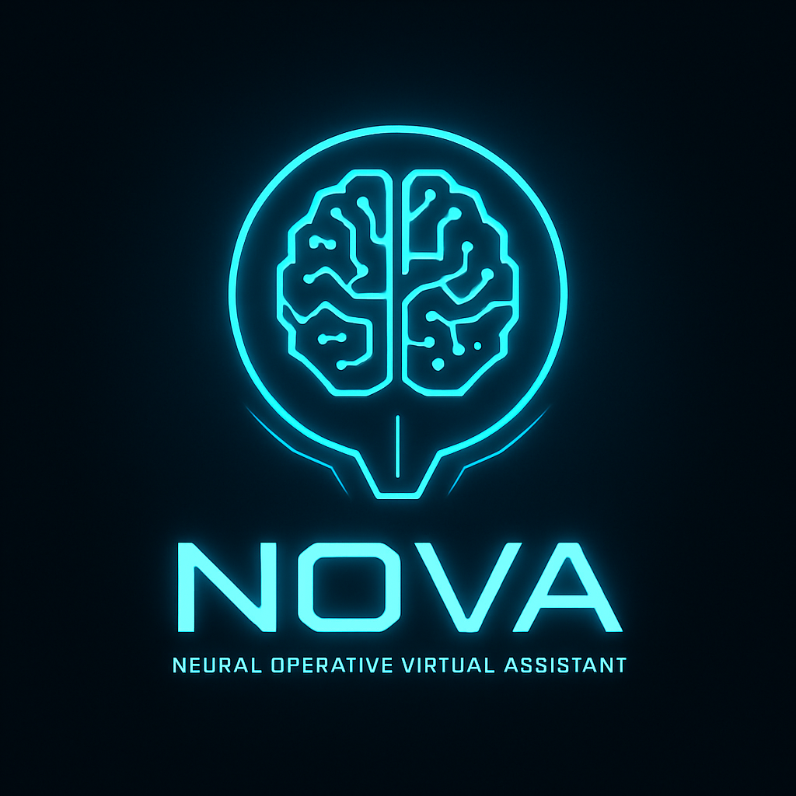

<div align="center">
  
</div>

<div align="center">
  <h1>NOVA: Local Linux AI Voice Assistant</h1>
</div>

NOVA is a fully local, privacy-first AI voice assistant for Linux, powered by a lightweight LLM (TinyLlama via Ollama). NOVA listens for your voice commands, answers questions, and provides Linux help—all offline, with no cloud dependencies.

## Features
- Voice-only activation and interaction
- Local LLM (TinyLlama) for all responses—no hardcoded commands
- Short, concise answers by default
- Interruptible speech: speak at any time to stop the current response
- Fully offline and privacy-respecting
- Persistent memory and logs (local only)

## Installation
1. Clone this repo
2. `cd NOVA`
3. Install dependencies: `pip install -r requirements.txt`
4. [Install Ollama](https://ollama.com/download) and pull the TinyLlama model:
   ```sh
   ollama pull tinyllama
   ollama serve &
   ```

## Usage
- Start NOVA:
  ```sh
  python main.py
  ```
- Speak your command or question when prompted.
- NOVA will respond with a short answer. You can interrupt her at any time by speaking again.

## How It Works
- All user input is sent to the local LLM (TinyLlama) via Ollama.
- NOVA does not use any hardcoded command logic—everything is handled by the LLM.
- The system prompt instructs the LLM to keep responses short and professional.
- Voice recognition is powered by Vosk; text-to-speech uses pyttsx3 or RHVoice.

## Privacy
- NOVA runs entirely on your machine. No data is sent to the cloud.
- All logs and memory are stored locally and can be deleted at any time.

---

*Professional, private, and always local—NOVA is your Linux voice companion.* 